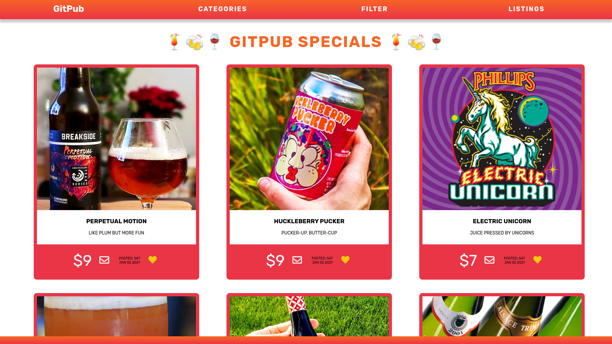
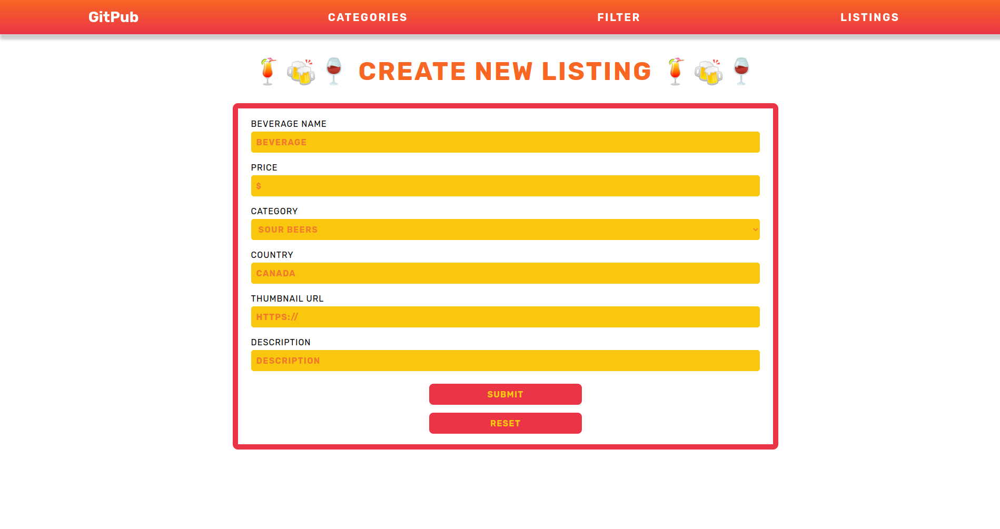
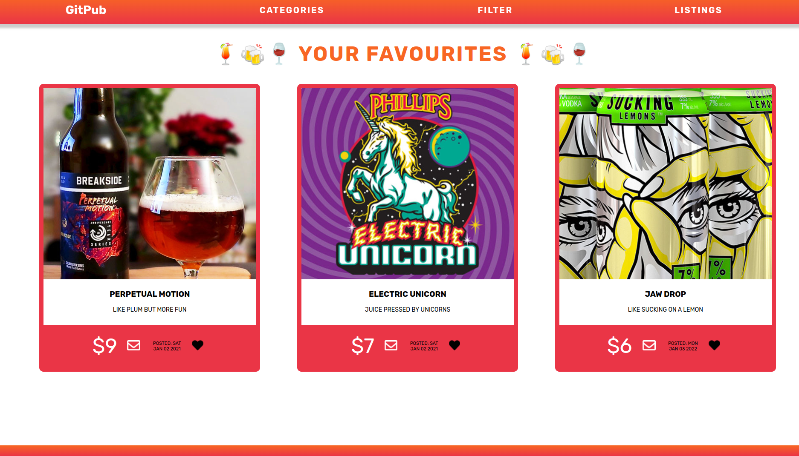
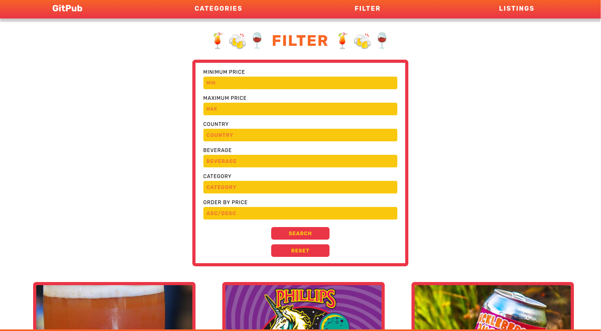
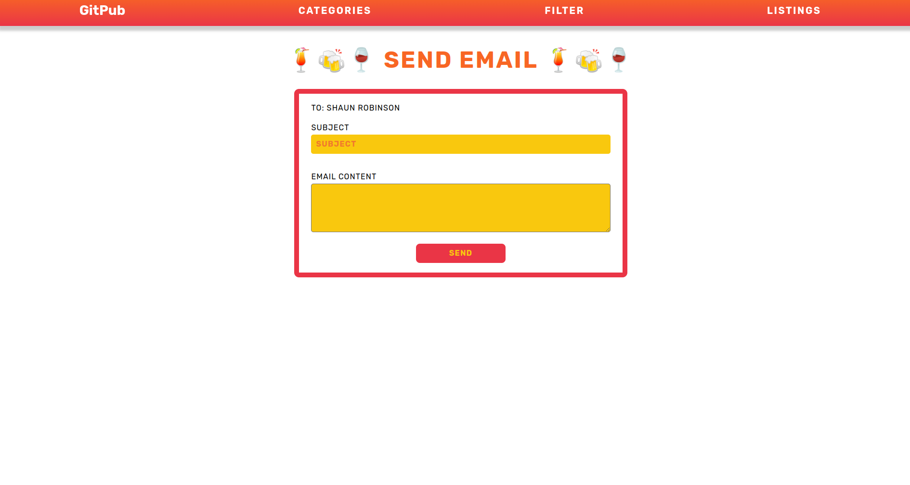

Buy & Sell App - Lighthouse Labs Midterm Project
=========

# GITPUB

Are you of drinking age? If yes, please proceed. Else, maybe next time!

GitPub is a buy-and-sell app for Alcoholic beverages. This app is created with Node.js, Express, and PostgreSQL.

# Getting Started

1. Create the `.env` by using `.env.example` as a reference: `cp .env.example .env`
2. Update the .env file with your correct local information 
  - username: `labber` 
  - password: `labber` 
  - database: `midterm`
3. Install dependencies: `npm i`
4. Fix to binaries for sass: `npm rebuild node-sass`
5. Reset database: `npm run db:reset`
  - Check the db folder to see what gets created and seeded in the SDB
7. Run the server: `npm run local`
  - Note: nodemon is used, so you should not have to restart your server
8. Visit `http://localhost:8080/`

# Warnings & Tips

- Do not edit the `layout.css` file directly, it is auto-generated by `layout.scss`
- Split routes into their own resource-based file names, as demonstrated with `users.js` and `widgets.js`
- Split database schema (table definitions) and seeds (inserts) into separate files, one per table. See `db` folder for pre-populated examples. 
- Use the `npm run db:reset` command each time there is a change to the database schema or seeds. 
  - It runs through each of the files, in order, and executes them against the database. 
  - Note: you will lose all newly created (test) data each time this is run, since the schema files will tend to `DROP` the tables and recreate them.

# Dependencies

- Node 10.x or above
- NPM 5.x or above
- PG 6.x
- @sendgrid/mail
- chalk
- cookie-session
- dotenv
- ejs
- express
- morgan
- pg
- sass
- nodemon

# User Stories

## Users can:
- As a user, I can have have access to everything through the navbar for quick and easy navigation

- As a user, I can see all the featured items on the main feed because I want to see what they are selling

- As a user, I can filter items by price because I want to stay within my budget

- As a user, I can favorite items because I want to check up on them later for quick access and have a heart icon that turns black to indicate that I favourited the item

- As a user, I am able to send an email to the user that is listing the item if I want to buy or negotiate said item

## Admins can:
- As an Admin, I can also use the website to buy items from listings other users have posted

- As an Admin, I can post items which can be seen by all users, but I can't post to another seller's listings page

- As an Admin, I can remove my listings from the site

- As an Admin, I can mark my listings as SOLD

- As an Admin, I can send an email to the buyer to reply back on negotiations in buying an item 

# ERD

# Wireframes

## Splitting up the work
Worked together with mix of all three approaches, but mostly pair programmed together or with a mentor

## Communication
Communication was done through Discord and Zoom.

# Final Product

